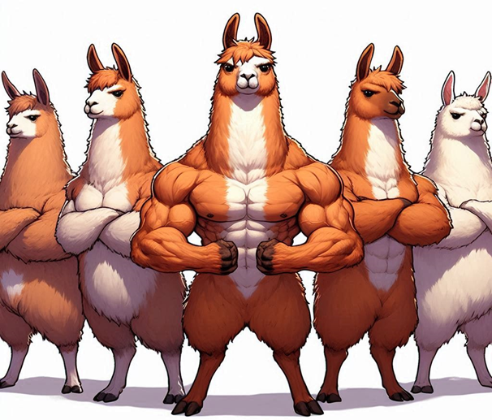
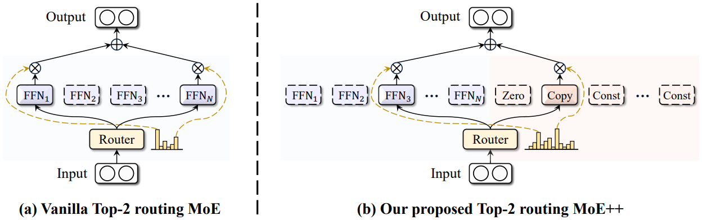
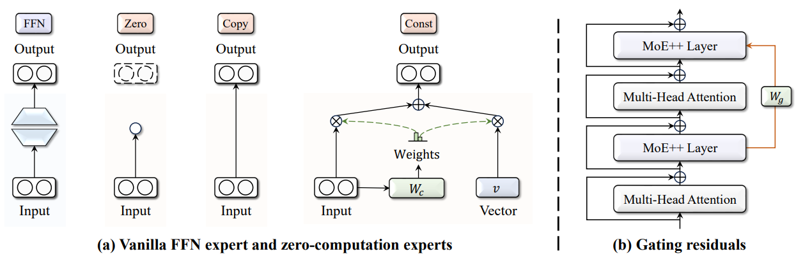
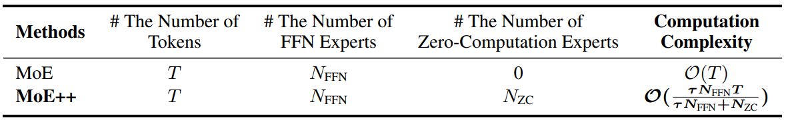
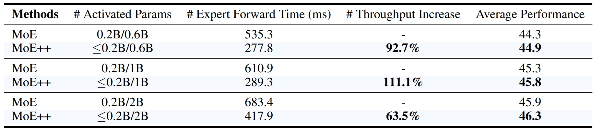
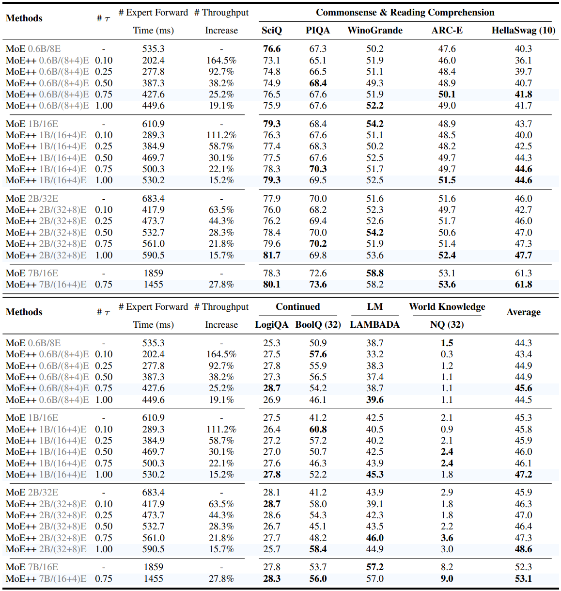
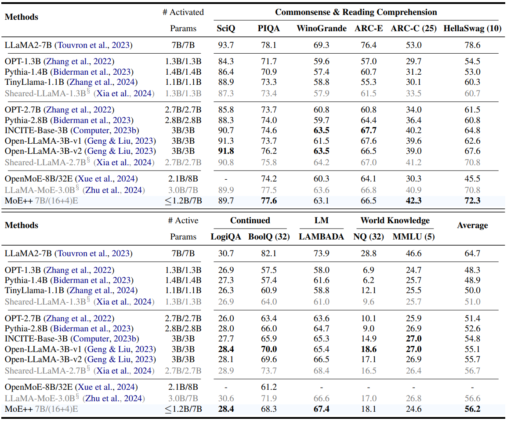
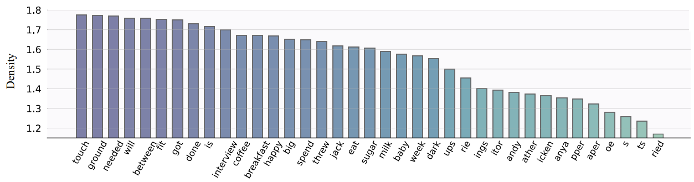
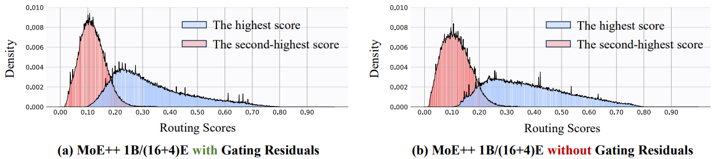

<div align=center>

</div>

<h2 align="center"> <a href="https://arxiv.org/abs/2410.07348">MoE++: Accelerating Mixture-of-Experts Methods with Zero-Computation Experts

</a></h2>
<h5 align="center"> If you like our project, please give us a star ⭐ on GitHub for the latest update.</h5>

<h5 align=center>

<!-- [](https://huggingface.co/spaces/Chat-UniVi/Chat-UniVi) -->
[](https://huggingface.co/Chat-UniVi)
[](https://arxiv.org/abs/2410.07348)
[](https://github.com/SkyworkAI/MoE-plus-plus/blob/main/LICENSE)
[](https://hits.seeyoufarm.com)
[](https://github.com/SkyworkAI/MoE-plus-plus/issues?q=is%3Aopen+is%3Aissue)
[](https://github.com/SkyworkAI/MoE-plus-plus/issues?q=is%3Aissue+is%3Aclosed)
</h5>

<details open><summary>💡 I also have other projects that may interest you ✨. </summary><p>
<!--  may -->
    
> [**Chat-UniVi: Unified Visual Representation Empowers Large Language Models with Image and Video Understanding**](https://arxiv.org/abs/2311.08046) <br>
> Peng Jin, Ryuichi Takanobu, Wancai Zhang, Xiaochun Cao, Li Yuan <br>
[](https://github.com/PKU-YuanGroup/Chat-UniVi)  [](https://github.com/PKU-YuanGroup/Chat-UniVi) [](https://arxiv.org/abs/2311.08046) [-FFD93D.svg)](https://cvpr.thecvf.com/) <br>
    
> [**MoH: Multi-Head Attention as Mixture-of-Head Attention**](https://github.com/SkyworkAI/MoH) <br>
> Peng Jin, Bo Zhu, Li Yuan, Shuicheng Yan <br>
[](https://github.com/SkyworkAI/MoH)  [](https://github.com/SkyworkAI/MoH) <br>

-->

</p></details>

## 📣 News
* **[2024/10/08]**  Model weight and inference code are available now! Welcome to **watch** 👀 this repository for the latest updates.

## ⚡ Overview
We introduce three types of zero-computation experts: the zero expert, copy expert, and constant expert, which correspond to discard, skip, and replace operations, respectively. Moreover, we leverage gating residuals, enabling each token to consider the pathway taken in the previous layer when selecting the appropriate experts.

<div align=center>

</div>

<div align=center>

</div>

### Download URL
<div align=center>
  
|         |                               HuggingFace Model                                |  
|:-------:|:------------------------------------------------------------------------------:|
| **MoE++7B-Base**     |     🤗 [MoE++7B-Base](https://huggingface.co/Chat-UniVi/MoE-Plus-Plus-7B)     |
| **MoE++7B-Chat** |                               😊 [Coming Soon]()                               | 
</div>


## 😮 Highlights
### 💡 Low Computing Overhead
For an MoE++ model, its computational complexity is always **less than** that of MoE models with the same number of parameters.

<div align=center>

</div>

### 🔥 High Performance & High Throughput
Extensive experimental results demonstrate that MoE++ achieves better performance while delivering 1.1~2.1x expert forward throughput compared to a vanilla MoE model of the same size, which lays a solid foundation for developing advanced and efficient MoE-related models.

<div align=center>

</div>

### 🤗 Deployment Friendly
Given that zero-computation experts have negligible parameters, we can deploy all zero-computation experts on each GPU, eliminating the significant communication overhead and expert load imbalance associated with FFN experts distributed across different GPUs.


## 🚀 Main Results
### Comparisons between MoE++ and Vanilla MoE Models

<div align=center>

</div>

### Comparisons to LLMs of Equivalent Activated Parameters

<div align=center>

</div>

## 😍 Why is MoE++ better than MoE?
### Flexible Computation Allocation
MoE++ allows simple tokens to utilize fewer FFN experts, freeing up more FFN experts to focus on challenging tokens. This results in both **Reduced Computation** and **Enhanced Performance**.

<div align=center>

</div>

* Verbs tend to activate a large number of FFN experts. For example, the verb "touch" activates an average of 1.77 FFN experts across all layers, approaching the upper limit of 2. This likely occurs because verbs often convey rich semantic information and frequently interact with nouns to form more complex semantic structures. 
* Nouns typically activate a moderate number of FFN experts, with most nouns averaging between 1.5 and 1.7 FFN expert activations. 
* Simple tokens with little semantic tend to activate a small number of FFN experts. For example, word fragments, such as "pper" and "ather", usually activate fewer than 1.5 FFN experts. 

These findings confirm that MoE++ allows simple tokens to utilize fewer FFN experts, freeing up more FFN experts to focus on challenging tokens.

### Stable Routing
Gating residuals effectively establish connections between different MoE++ layers and reduce the variance of routing scores. Meanwhile, the gating residuals do not change the mean and range of values of the routing scores. Consequently, gating residuals contribute to the stable routing of heterogeneous expert architectures in MoE++.

<div align=center>

</div>


## 🤖 API for Model Inference
If you want to load the model from the model hub on Hugging Face or on local, you can use the following code snippets.

### Base Model Inference
```python
from transformers import AutoModelForCausalLM, AutoTokenizer

question = "Hello!"

model = AutoModelForCausalLM.from_pretrained("Chat-UniVi/MoE-Plus-Plus-7B", trust_remote_code=True, device_map='auto')
tokenizer = AutoTokenizer.from_pretrained("Chat-UniVi/MoE-Plus-Plus-7B", trust_remote_code=True)

inputs = tokenizer(question, return_tensors='pt').to(model.device)
response = model.generate(inputs.input_ids, max_length=128)
print(tokenizer.decode(response.cpu()[0], skip_special_tokens=True))
```

### Chat Model Inference
Coming soon...

## 🗝️ Training & Validating
* The training code is built on [Skywork-MoE](https://github.com/SkyworkAI/Skywork-MoE). Unless Skywork-MoE is open source, we can't open source MoE++ alone. We will release the training code after the approval is completed.
* The evaluation is performed on multiple key benchmarks using the [Eleuther AI Language Model Evaluation Harness](https://github.com/EleutherAI/lm-evaluation-harness).

```python
# For example, test MoE++ on winogrande

CUDA_VISIBLE_DEVICES=0,1,2,3,4,5,6,7 accelerate launch \
--main_process_port 2004 -m lm_eval --model hf \
--model_args pretrained=Chat-UniVi/MoE-Plus-Plus-7B \
--tasks winogrande \
--batch_size 1 \
--output_path Results/winogrande
```

## 👍 Acknowledgement
* [Skywork-MoE](https://github.com/SkyworkAI/Skywork-MoE) The codebase we built upon and it is an advanced MoE language model.


## 🤝 Related Projects
* [MoH](https://github.com/SkyworkAI/MoH) MoH is a promising alternative to multi-head attention and provides a strong foundation for developing advanced and efficient attention-based models.
* [Chat-UniVi (CVPR 2024 Highlight)](https://github.com/PKU-YuanGroup/Chat-UniVi) The model is an efficient large language and video assistant. This framework exhibits remarkable interactive capabilities between images and videos.


## 🔒 License
* The majority of this project is released under the Apache 2.0 license as found in the [LICENSE](https://github.com/SkyworkAI/MoE-plus-plus/blob/main/LICENSE) file.
* The service is a research preview intended for non-commercial use only, subject to the model [License](https://github.com/facebookresearch/llama/blob/main/MODEL_CARD.md) of LLaMA, [Terms of Use](https://openai.com/policies/terms-of-use) of the data generated by OpenAI, and [Privacy Practices](https://chrome.google.com/webstore/detail/sharegpt-share-your-chatg/daiacboceoaocpibfodeljbdfacokfjb) of ShareGPT. Please contact us if you find any potential violations.


## ✏️ Citation
If you find this paper useful, please consider staring 🌟 this repo and citing 📑 our paper:
```
@article{jin2024moe,
  title={MoE++: Accelerating Mixture-of-Experts Methods with Zero-Computation Experts},
  author={Jin, Peng and Zhu, Bo and Yuan, Li and Yan, Shuicheng},
  journal={arXiv preprint arXiv:2410.07348},
  year={2024}
}
```

## ✨ Contributors
<a href="https://github.com/SkyworkAI/MoE-plus-plus/graphs/contributors">
  
</a>
